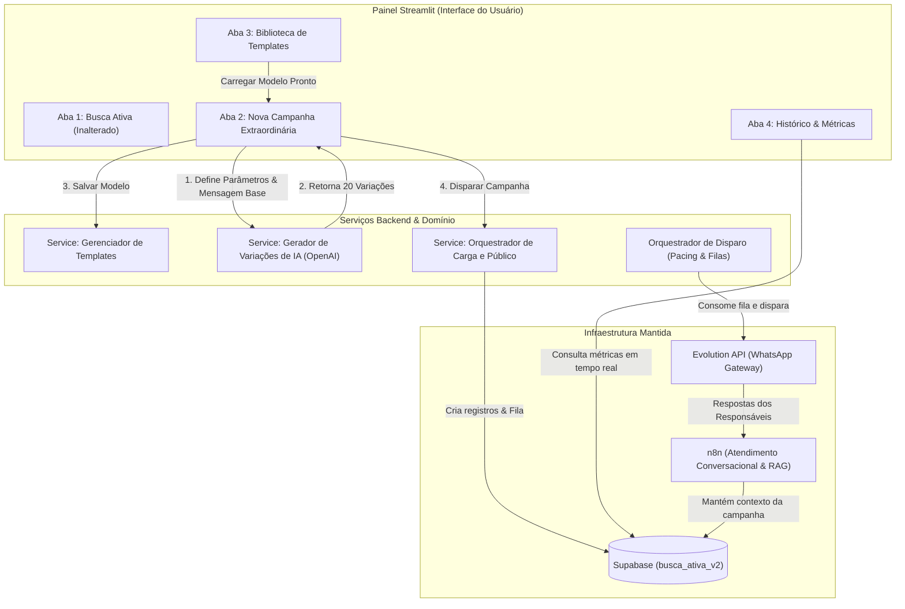

# Plano de Implementação: Gerenciador de Campanhas Extraordinárias e Templates Reutilizáveis

## Visão Geral

Este plano descreve a evolução da plataforma **Presença Ativa Inteligente (PAI)** de uma campanha pontual/fixa (ex: OBMEP / Busca Ativa Diária) para um **Gerenciador Genérico de Comunicação Escolar e Campanhas Extraordinárias** totalmente parametrizável via painel Streamlit, com suporte a **Templates Reutilizáveis** e **Geração de Variações de Mensagem por IA (Anti-Spam)**.

O princípio fundamental da arquitetura é a **Não-Regressão e Isolamento**: a rotina atual da Busca Ativa (Fases 0 a 3, fluxos n8n e relatórios) continuará 100% estável e intocada.

---

## Arquitetura da Solução

---

## 1. User Review Required

> [!IMPORTANT]
> **Estratégia de Schema no Supabase:**
> As novas tabelas e colunas serão adicionadas estritamente no schema `busca_ativa_v2` com migrações SQL versionadas. Nenhuma tabela existente da Busca Ativa será alterada de forma destrutiva. O campo `campaign_type` (já existente na tabela `campaigns`) será utilizado para diferenciar `"busca_ativa"`, `"obmep"` e `"extraordinary"`.

> [!TIP]
> **Preservação de Templates Reutilizáveis:**
> Ao salvar uma campanha como modelo (ex: "Volta às Aulas" ou "Reunião de Pais"), ela fica guardada na tabela `campaign_templates`. Em semestres futuros, qualquer usuário autorizado poderá clicar em **"Duplicar / Usar Template"**, pré-preencher o formulário, ajustar detalhes da mensagem ou público e gerar novas variações de IA com 1 clique.

---

## 2. Perguntas Abertas para Alinhamento

1. **Quantidade Padrão de Variações de Mensagem:** Definimos como padrão a geração de **20 variações** pela IA. Deseja que a quantidade seja um campo ajustável (ex: entre 5 e 50 variações)?
2. **Seleção de Público-Alvo:** Além dos filtros por **Turmas (múltipla escolha)** e **Toda a Escola**, desejamos incluir o filtro de **Status do Aluno** (ex: Apenas Faltosos, Todos os Alunos, Apenas Ativos)?

---

## 3. Mudanças Propostas por Componente

---

### [Componente 1] Banco de Dados & Modelagem (Supabase)

#### [NEW] [20260722_create_extraordinary_campaigns.sql](file:///c:/Users/user/presenca-ativa-inteligente/supabase/migrations/20260722_create_extraordinary_campaigns.sql)
Criar arquivo de migração para suportar a parametrização de campanhas extraordinárias e templates reutilizáveis no schema `busca_ativa_v2`:

1. **Tabela `busca_ativa_v2.campaign_templates`**:
   - `id` (uuid, primary key)
   - `school_id` (uuid, FK for `schools`)
   - `title` (text) - ex: "Convocação Reunião de Pais - 1º Semestre"
   - `category` (text) - ex: `INFORMATIVA`, `CONVOCACAO`, `EVENTO`, `LEMBRETE`, `REUNIAO`, `EMERGENCIAL`, `OUTRO`
   - `base_message` (text) - mensagem original com placeholders (`{{nome_responsavel}}`, `{{nome_aluno}}`, `{{turma}}`, etc.)
   - `target_audience_filter` (jsonb) - público alvo padrão do template
   - `created_at`, `updated_at` (timestamptz)

2. **Tabela `busca_ativa_v2.campaign_ai_variants`**:
   - `id` (uuid, primary key)
   - `campaign_id` (uuid, FK for `campaigns`)
   - `variant_index` (integer) - índice 1..N
   - `message_text` (text) - variação da mensagem gerada pela IA
   - `created_at` (timestamptz)

3. **Campos Adicionais em `busca_ativa_v2.campaigns` (Retrocompatível)**:
   - `category` (text, nullable)
   - `base_message` (text, nullable)
   - `target_filter` (jsonb, nullable) - armazena filtros como `{"classes": ["6A", "6B"], "all_school": false, "absence_only": false}`
   - `template_id` (uuid, nullable) - referência ao template de origem se houver

---

### [Componente 2] Camada de Domínio e Serviços de Aplicação

#### [NEW] [campaign_ai_service.py](file:///c:/Users/user/presenca-ativa-inteligente/app/services/campaign_ai_service.py)
Serviço responsável pela inteligência das mensagens:
- Recebe a mensagem base com placeholders e o tipo/tom da campanha.
- Chama a API da OpenAI (`gpt-4o-mini`) com structured output/JSON mode pedindo exatamente $N$ (ex: 20) variações com mesmo significado, mantendo os placeholders intactos (`{{nome_responsavel}}`, `{{nome_aluno}}`, `{{turma}}`, `{{escola}}`), tom empático/formal escolar e sem repetir frases-padrão de spam.
- Validação automática de integridade: garante que todos os placeholders originais estão presentes em 100% das variações geradas.

#### [NEW] [extraordinary_campaign_service.py](file:///c:/Users/user/presenca-ativa-inteligente/app/services/extraordinary_campaign_service.py)
Serviço responsável pelo ciclo de vida da campanha extraordinária:
- `create_campaign_draft()`: Registra rascunho de campanha com seu público alvo e mensagem base.
- `save_ai_variants()`: Grava as variações aprovadas.
- `enqueue_extraordinary_messages()`: Consulta o banco de alunos e contatos de acordo com o filtro de público (Toda a escola ou turmas selecionadas), distribui uniformemente as 20 variações de mensagem entre os destinatários e insere as mensagens como `pending` na tabela `busca_ativa_v2.messages`.
- `create_template_from_campaign()` e `load_template()`: Gestão da biblioteca de modelos.

#### [MODIFY] [repositories.py](file:///c:/Users/user/presenca-ativa-inteligente/app/infrastructure/supabase/repositories.py)
Adicionar métodos repositórios para manipular templates, variações de IA e relatórios de campanhas extraordinárias sem alterar as consultas existentes da Busca Ativa.

---

### [Componente 3] Painel de Controle Streamlit

#### [MODIFY] [painel.py](file:///c:/Users/user/presenca-ativa-inteligente/painel.py)
Reorganizar o painel em uma estrutura limpa e intuitiva por **Abas Nativas (st.tabs)** para facilitar o fluxo de trabalho do usuário:

1. **Aba 1: 🚨 Busca Ativa (Inalterada)**
   - Mantém as Fases 0, 1, 1.5, 2 e 3 da Busca Ativa exatamente como funcionam hoje, garantindo continuidade total.

2. **Aba 2: 📢 Nova Campanha Extraordinária**
   - **Formulário de Parametrização:**
     - Nome da Campanha (ex: "Volta às Aulas 2026", "Reunião de Pais - 2º Bimestre").
     - Tipo/Categoria (Informativa, Convocação, Evento, Lembrete, Reunião, Emergencial, Outro).
     - Público-Alvo (Toda a Escola OU Múltipla Escolha de Turmas: `6º A`, `6º B`, `7º A`, etc.).
     - Campo de Mensagem Base com indicação clara dos placeholders suportados.
   - **Gerador & Visualizador de IA:**
     - Botão "🤖 Gerar 20 Variações de Mensagem por IA".
     - Exibição organizada em carrossel/expanders das 20 variações com destaque visual.
     - Botão "🔄 Regerar Variações" caso o usuário queira refazer.
   - **Ações Finais:**
     - Checkbox / Botão "💾 Salvar como Template Reutilizável".
     - Botão de Destaque "🚀 Iniciar Campanha" (prepara a fila no Supabase e dispara o orquestrador com pacing anti-ban).

3. **Aba 3: 📁 Biblioteca de Templates**
   - Lista visual de modelos salvos com busca e filtros por categoria.
   - Card descritivo com mensagem base e público recomendado.
   - Botão "⚡ Usar este Template" (redireciona para a Aba 2 com todos os campos pré-preenchidos).

4. **Aba 4: 📊 Histórico & Métricas das Campanhas**
   - Seleção de qualquer campanha realizada no passado ou em andamento.
   - Cards de estatísticas em tempo real: Previstas, Enviadas, Entregues, Respondidas, Taxa de Resposta %, Status (Em andamento, Pausada, Finalizada).
   - Abas internas de detalhamento: Mensagem Base, Variações de IA Utilizadas, Lista de Destinatários e Respostas Recebidas via WhatsApp.

---

### [Componente 4] Orquestração & Resposta Conversacional (n8n / Backend)

#### [MODIFY] [campaign_orchestrator.py](file:///c:/Users/user/presenca-ativa-inteligente/scripts/campaign_orchestrator.py)
Garantir que o orquestrador identifique campanhas extraordinárias pela coluna `campaign_type` ou `campaign_id` específica e aplique a mesma cadência segura de envios (delays de 45-120s, logs de envio e tratamento de retentativas).

#### [MODIFY] [routes.py](file:///c:/Users/user/presenca-ativa-inteligente/app/api/routes.py)
Garantir que o endpoint de contexto da sessão (`/students/session_context`) retorne as informações da campanha extraordinária recente para que a IA 2 do n8n saiba qual comunicado o responsável recebeu ao responder a mensagem.

---

## Planos de Verificação & Teste

### Testes Automatizados
1. **Validação de Schema:** Testar a aplicação das migrações SQL no Supabase.
2. **Teste de Unidade do Gerador de IA:**
   - Executar script de teste para verificar se o serviço de IA gera 20 variações sem perder nenhum dos placeholders (`{{nome_responsavel}}`, `{{nome_aluno}}`, `{{turma}}`).
3. **Teste de Carga de Fila (Dry Run):**
   - Criar uma campanha simulada (Dry Run) com público de 2 turmas e verificar se a tabela `busca_ativa_v2.messages` é populada corretamente com a distribuição das variações.

### Verificação Manual no Streamlit & WhatsApp
1. Acessar o painel no navegador (`http://localhost:8501`).
2. Navegar pelas novas abas e criar uma campanha de teste "Reunião de Pais".
3. Testar a geração das 20 variações de mensagem com a OpenAI.
4. Salvar a campanha como Template e verificar o aparecimento na Biblioteca de Templates.
5. Executar a simulação de disparo (Dry Run) e validar o painel de métricas.
